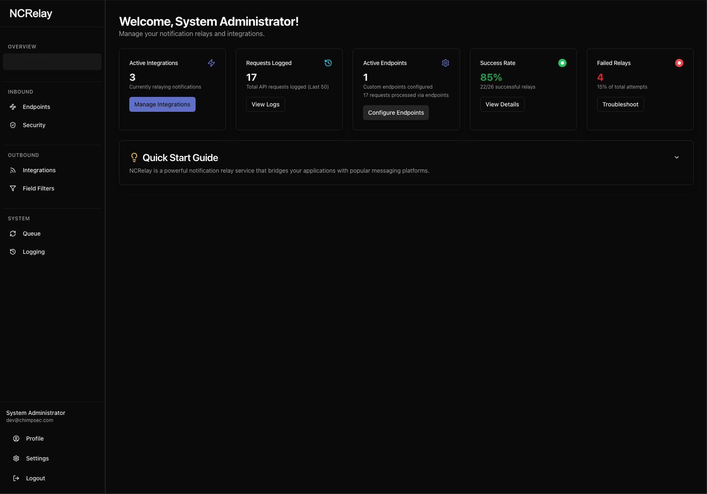

# NCRelay

**Securely relay notifications to your favorite platforms.**

NCRelay is a powerful notification relay service that receives XML data via custom API endpoints and forwards it to various messaging platforms like Slack, Discord, Microsoft Teams, and generic webhooks. Built with Next.js 15 and SQLite, it provides a secure, self-hosted solution for managing notification workflows.

<div align="center">
  
</div>

## 🚀 Features

- **Custom API Endpoints**: Create custom API paths to receive XML notifications
- **IP Address Whitelisting**: Restrict endpoint access to specific IP addresses for enhanced security
- **Multi-Platform Support**: Integrate with Slack, Discord, Microsoft Teams, and generic webhooks
- **Flexible Data Transformation**: Convert XML to JSON, plain text, or keep as XML
- **Advanced Field Filtering**: Visual field selection and extraction from XML without regex knowledge
- **Secure Authentication**: User management with bcrypt password hashing
- **Comprehensive Logging**: Track all requests and relay attempts with detailed logs
- **Intuitive Dashboard**: Clean, modern UI for managing integrations and monitoring
- **SMTP Configuration**: Email notifications and password reset functionality
- **Data Encryption**: Sensitive data like webhook URLs are encrypted at rest
- **Self-Hosted**: Full control over your data and infrastructure
- **Docker Support**: Optimized containerization with Alpine-based images, multi-stage builds, and proper security practices

## 📋 Prerequisites

- Node.js 18+ 
- npm or yarn
- SQLite (included with better-sqlite3)

## 🛠️ Installation

1. **Clone the repository**
   ```bash
   git clone <repository-url>
   cd ncrelay
   ```

2. **Install dependencies**
   ```bash
   npm install
   ```

3. **Set up environment variables**
   Create a `.env.local` file in the root directory:
   ```env
   # Database
   NODE_ENV=development

   # Initial Admin User (required for first setup)
   INITIAL_ADMIN_EMAIL=admin@example.com
   INITIAL_ADMIN_PASSWORD=your-secure-password
   INITIAL_ADMIN_NAME=Admin User

   # Encryption Key (generate a secure 32-character key)
   ENCRYPTION_KEY=your-32-character-encryption-key

   # Optional: Custom port
   PORT=9005
   ```

4. **Start the development server**
   ```bash
   npm run dev
   ```

5. **Access the application**
   Open [http://localhost:9005](http://localhost:9005) in your browser

## 🐳 Docker Deployment

NCRelay is available as a Docker image from GitHub Container Registry:

```yaml
# docker-compose.yml
version: '3'
services:
  ncrelay:
    image: ghcr.io/theonlytruebigmac/ncrelay:1.2.3  # Replace with desired version
    ports:
      - "9005:9005"
    volumes:
      - ./data:/data
    environment:
      - NODE_ENV=production
      - ENCRYPTION_KEY=your-32-character-encryption-key
      - INITIAL_ADMIN_EMAIL=admin@example.com
      - INITIAL_ADMIN_PASSWORD=your-secure-password
```

Run with:
```bash
docker-compose up -d
```

For details on available image tags and versioning, see our [documentation](docs/VERSIONING.md).

## 🎯 Usage Guide

### Managing Integrations

Create and manage integrations with various platforms to relay your notifications.

<div align="center">
  
</div>

1. Navigate to **Dashboard → Integrations**
2. Click **Add Integration**
3. Configure your platform:
   - **Name**: Descriptive name for the integration
   - **Platform**: Choose from Slack, Discord, Teams, or Generic Webhook
   - **Webhook URL**: The destination URL for notifications
   - **Target Format**: How to transform XML data (JSON, Text, or XML)

<div align="center">
  
</div>

### Setting up API Endpoints

Create custom API endpoints to receive notifications from your systems.

1. Go to **Dashboard → Settings → API Endpoints**
2. Click **Add API Endpoint**
3. Configure:
   - **Name**: Descriptive name
   - **Associated Integrations**: Select which integrations to trigger
   - **IP Address Whitelist**: (Optional) Restrict access to specific IP addresses
4. Use the generated secure UUID path for your endpoint

<div align="center">
  
</div>

### Monitoring the Notification Queue

Keep track of all notification attempts and their status through the queue page.

<div align="center">
  
</div>

View detailed information about each notification, including its payload and response:

<div align="center">
  
</div>

### Comprehensive Logging

Review detailed logs of all API requests and system activity for monitoring and troubleshooting.

<div align="center">
  
</div>

### System Settings

Configure global system settings, including security options.

<div align="center">
  
</div>

### IP Address Whitelisting

For enhanced security, you can restrict endpoint access to specific IP addresses:

- **Leave empty**: Allow access from any IP address (default)
- **Add specific IPs**: Only allow requests from specified IP addresses
- **Supports IPv4 and IPv6**: e.g., `192.168.1.100`, `2001:db8::1`
- **Localhost handling**: `127.0.0.1`, `::1`, and `localhost` are treated as equivalent

**Example**: Restrict to local and specific server access:
```
127.0.0.1
192.168.1.50
10.0.0.100
```

<div align="center">
  
</div>

### Field Filtering

NCRelay provides powerful field filtering capabilities to extract and transform specific data from XML notifications before forwarding them to integrations.

#### Creating Field Filters

1. **Navigate to Field Filters**: Go to **Dashboard → Field Filters**
2. **Create New Filter**: Click **Add Field Filter**
3. **Upload Sample XML**: Paste a sample XML notification from your source system
4. **Extract Fields**: Click "Extract Fields" to automatically identify all available fields
5. **Select Fields**: Choose which fields to include or exclude using checkboxes
6. **Save Configuration**: Give your filter a name and description

<div align="center">
  
</div>

<div align="center">
  
</div>

#### Benefits of Field Filters

- **No Regular Expression Knowledge Required**: Visual field selection instead of complex regex patterns
- **Consistent Data Extraction**: Reliable parsing regardless of XML structure variations
- **Reusable Configurations**: Create once, use across multiple integrations
- **Data Privacy**: Filter out sensitive information before forwarding

#### Using Field Filters in Integrations

When creating or editing an integration:

1. **Select Field Filter**: Choose a previously created filter from the dropdown
2. **Apply to Integration**: The filter will process all XML data for that integration
3. **Test and Verify**: Send test notifications to ensure proper field extraction

#### Example: N-Central Alert Filtering

**Original XML**:
```xml
<?xml version="1.0"?>
<notification>
  <devicename>SERVER-01</devicename>
  <alertmessage>High CPU Usage Detected</alertmessage>
  <severity>high</severity>
  <timestamp>2024-01-15T10:30:00Z</timestamp>
  <internal_id>12345</internal_id>
  <customer_name>Acme Corp</customer_name>
</notification>
```

**After Field Filter** (excluding internal_id):
```json
{
  "devicename": "SERVER-01",
  "alertmessage": "High CPU Usage Detected", 
  "severity": "high",
  "timestamp": "2024-01-15T10:30:00Z",
  "customer_name": "Acme Corp"
}
```

#### Field Filter vs Integration Processing

- **Field Filters**: Applied first to extract/filter XML fields
- **Integration Processing**: Applied second to format data for the target platform
- **Combined**: Field filters + platform formatting = clean, targeted notifications

#### Migration from Grok Patterns

If you're upgrading from Grok patterns:

1. **Backward Compatible**: Existing Grok patterns continue to work
2. **Recommended Migration**: Use field filters for new setups
3. **Migration Guide**: See [Field Filter Migration Documentation](/docs/migrating-to-field-filters.md)


### Sending Notifications

Send XML data to your custom endpoint:

```bash
curl -X POST \
  http://localhost:9005/api/custom/your-secure-endpoint-uuid \
  -H "Content-Type: application/xml" \
  -d '<?xml version="1.0"?>
      <notification>
        <title>Alert Title</title>
        <message>Your notification message here</message>
        <severity>high</severity>
      </notification>'
```

**Note**: Each endpoint uses a secure, randomly generated UUID path to prevent enumeration attacks.

### Platform-Specific Integrations

#### Slack Integration
- **Webhook URL**: Your Slack webhook URL
- **Target Format**: Text or JSON
- **Text Output**: Extracts readable text from XML
- **JSON Output**: Full XML converted to JSON

<div align="center">
  
  
</div>

#### Discord Integration
- **Webhook URL**: Your Discord webhook URL  
- **Target Format**: Text (recommended)
- **Output**: Formatted as Discord message content

<div align="center">
  
  
</div>

#### Microsoft Teams
- **Webhook URL**: Your Teams connector webhook
- **Target Format**: Text or JSON
- **Output**: Formatted for Teams cards or simple text

<div align="center">
  
  
</div>

## 🔒 Security Features

- **Password Hashing**: bcrypt with salt rounds
- **Data Encryption**: Sensitive data encrypted at rest
- **IP Address Whitelisting**: Restrict endpoint access to specific IP addresses
- **Data Privacy**: Field filters prevent sensitive information from being forwarded
- **Secure Endpoint Paths**: Random UUID paths prevent enumeration attacks
- **Session Management**: Secure authentication system
- **Input Validation**: XML parsing and validation
- **Error Handling**: Detailed logging without exposing internals

## 🏗️ Development

### Project Structure
```
src/
├── app/                    # Next.js app directory
│   ├── (app)/             # Authenticated routes
│   ├── api/               # API routes
│   └── page.tsx           # Root page
├── components/            # React components
├── context/               # React contexts
├── lib/                   # Utilities and database
└── config/                # Configuration files
```

### Available Scripts

```bash
# Development
npm run dev          # Start dev server with Turbopack on port 9005

# Production
npm run build        # Build for production
npm start           # Start production server

# Quality
npm run lint        # Run ESLint
npm run typecheck   # Run TypeScript checks
```

### Database Schema

#### Tables
- **users**: User accounts and authentication
- **integrations**: Messaging platform configurations
- **api_endpoints**: Custom API endpoint definitions with IP whitelist support
- **field_filters**: Field extraction and filtering configurations
- **request_logs**: API request and processing logs
- **smtp_settings**: Email configuration
- **password_reset_tokens**: Password reset functionality

## 🚀 Deployment

### Docker (Recommended)
The recommended deployment method is using Docker with the provided images. See our [detailed deployment guide](docs/DEPLOYMENT.md) for complete instructions.

### Environment Setup
- Ensure `/data` directory exists for production database
- Set strong `ENCRYPTION_KEY` and admin credentials
- Configure reverse proxy if needed

### Database Persistence
- Development: Database file in project directory
- Production: Mount `/data` volume for persistence

## 🤝 Contributing

1. Fork the repository
2. Create a feature branch (`git checkout -b feature/amazing-feature`)
3. Commit your changes (`git commit -m 'Add amazing feature'`)
4. Push to the branch (`git push origin feature/amazing-feature`)
5. Open a Pull Request

## 📝 License

This project is licensed under the MIT License - see the LICENSE file for details.

## 🆘 Support

For support and questions:
- Check the logs in the Dashboard for troubleshooting
- Review the API endpoint configuration
- Verify webhook URLs are accessible
- Ensure XML payload format is valid

## 🔄 API Reference

### Custom Endpoints

**POST** `/api/custom/{endpointUUID}`
- **Content-Type**: `application/xml` or `text/xml`
- **Body**: Valid XML payload
- **Security**: IP whitelist validation (if configured)
- **Response**: Processing summary with integration results

**GET** `/api/custom/{endpointUUID}`
- **Response**: Endpoint information and status

### Error Codes
- **403 Forbidden**: IP address not in endpoint whitelist
- **404 Not Found**: Endpoint UUID not found
- **400 Bad Request**: Invalid XML payload or content type

## 📝 License

This project is licensed under the MIT License - see the LICENSE file for details.

## 📚 Documentation

For more detailed information, please refer to our documentation:

- [Deployment Guide](docs/DEPLOYMENT.md)
- [Development Guide](docs/DEVELOPMENT.md)
- [IP Whitelisting](docs/ip-whitelisting.md)
- [Field Filters](docs/field-filters.md)
- [Enhanced Message Formatting](docs/enhanced-message-formatting.md)
- [Versioning](docs/VERSIONING.md)
- [Docker Build Troubleshooting](docs/DOCKER-BUILD-TROUBLESHOOTING.md)
- [GitHub Container Registry Setup](docs/GHCR-SETUP.md)

---

**NCRelay** - Secure, reliable notification relay service
