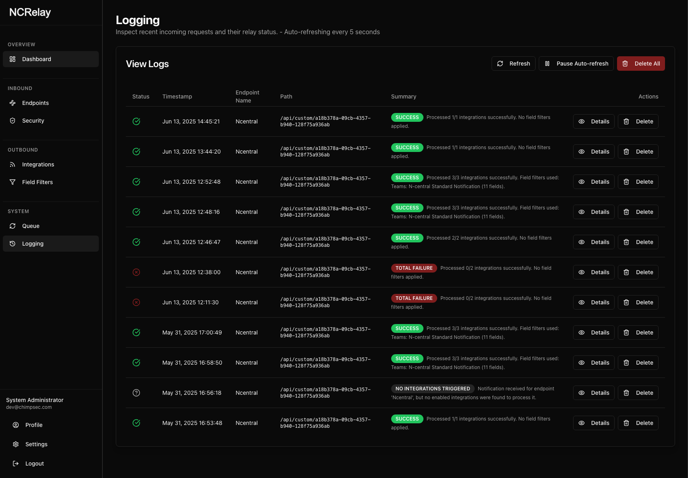
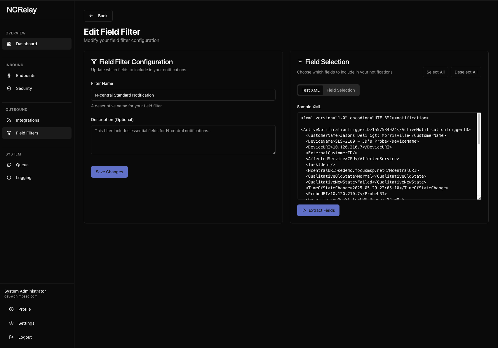

# NCRelay

**Securely relay notifications to your favorite platforms.**

NCRelay is a powerful, enterprise-ready notification relay service that receives webhook data via custom API endpoints and forwards it to various messaging platforms like Slack, Discord, Microsoft Teams, and generic webhooks. Built with Next.js 15 and SQLite, it provides a secure, self-hosted solution for managing complex notification workflows with advanced transformation capabilities.

<div align="center">
  
</div>

## 🚀 Features

### Core Capabilities
- **Custom API Endpoints**: Create custom API paths to receive webhook notifications from any system
- **Multi-Platform Support**: Integrate with Slack, Discord, Microsoft Teams, Email, and generic webhooks
- **Advanced Field Filtering**: Visual field selection and extraction from XML/JSON without regex knowledge
- **Flexible Data Transformation**: Convert XML to JSON, plain text, or keep as XML with custom formatting
- **Notification Queue**: Reliable delivery with automatic retry logic and failure tracking
- **Enhanced Message Formatting**: Platform-specific rich formatting with colors, fields, and structured layouts

### Security & Access Control
- **Multi-Factor Authentication (2FA)**: TOTP-based two-factor authentication with QR code setup and backup codes
- **Active Session Management**: Track and manage user sessions across devices with IP and location tracking
- **Security Audit Logs**: Comprehensive audit trail of all security events (logins, logouts, 2FA, password changes)
- **Security Policies**: Configurable password requirements, 2FA enforcement, session timeouts, and account lockout policies
- **API Rate Limiting**: Configurable request limits with IP whitelisting to prevent abuse
- **IP Address Whitelisting**: Restrict endpoint access to specific IP addresses for enhanced security
- **Secure Authentication**: JWT-based user management with bcrypt password hashing
- **Data Encryption**: Sensitive data like webhook URLs and secrets are encrypted at rest
- **Secure Endpoint Paths**: Random UUID paths prevent enumeration attacks

### Monitoring & Management
- **Comprehensive Logging**: Track all requests and relay attempts with detailed logs and full request/response capture
- **Notification Queue Management**: View, retry, and manage queued notifications with status tracking
- **Request Audit Trail**: Full request/response logging with searchable and filterable interface
- **User Notification Preferences**: Per-user notification settings with digest email support (hourly, daily, weekly)
- **Scheduled Background Tasks**: Automatic log cleanup, database backups, queue processing, and digest emails

### User Experience
- **Intuitive Dashboard**: Clean, modern UI for managing integrations and monitoring
- **Dark/Light Theme**: User preference with system theme detection
- **SMTP Configuration**: Email notifications and password reset functionality
- **Self-Hosted**: Full control over your data and infrastructure
- **Docker Support**: Optimized containerization with Alpine-based images, multi-stage builds, and proper security practices

## 📋 Prerequisites

- Node.js 18+ 
- npm or yarn
- SQLite (included with better-sqlite3)

## 🛠️ Installation

1. **Clone the repository**
   ```bash
   git clone <repository-url>
   cd ncrelay
   ```

2. **Install dependencies**
   ```bash
   npm install
   ```

3. **Set up environment variables**
   Create a `.env.local` file in the root directory:
   ```env
   # Database
   NODE_ENV=development

   # Initial Admin User (required for first setup)
   INITIAL_ADMIN_EMAIL=admin@example.com
   INITIAL_ADMIN_PASSWORD=your-secure-password
   INITIAL_ADMIN_NAME=Admin User

   # Encryption Key (generate a secure 32-character key)
   ENCRYPTION_KEY=your-32-character-encryption-key

   # Optional: Custom port
   PORT=9005
   ```

4. **Start the development server**
   ```bash
   npm run dev
   ```

5. **Access the application**
   Open [http://localhost:9005](http://localhost:9005) in your browser

## 🐳 Docker Deployment

NCRelay is available as a Docker image from GitHub Container Registry:

```yaml
# docker-compose.yml
version: '3'
services:
  ncrelay:
    image: ghcr.io/theonlytruebigmac/ncrelay:1.2.3  # Replace with desired version
    ports:
      - "9005:9005"
    volumes:
      - ./data:/data
    environment:
      - NODE_ENV=production
      - ENCRYPTION_KEY=your-32-character-encryption-key
      - INITIAL_ADMIN_EMAIL=admin@example.com
      - INITIAL_ADMIN_PASSWORD=your-secure-password
```

Run with:
```bash
docker-compose up -d
```

For details on available image tags and versioning, see our [documentation](docs/VERSIONING.md).

## 🎯 Usage Guide

### Managing Integrations

Create and manage integrations with various platforms to relay your notifications.

<div align="center">
  
</div>

1. Navigate to **Dashboard → Integrations**
2. Click **Add Integration**
3. Configure your platform:
   - **Name**: Descriptive name for the integration
   - **Platform**: Choose from Slack, Discord, Teams, or Generic Webhook
   - **Webhook URL**: The destination URL for notifications
   - **Target Format**: How to transform XML data (JSON, Text, or XML)

<div align="center">
  
</div>

### Setting up API Endpoints

Create custom API endpoints to receive notifications from your systems.

1. Go to **Dashboard → Settings → API Endpoints**
2. Click **Add API Endpoint**
3. Configure:
   - **Name**: Descriptive name
   - **Associated Integrations**: Select which integrations to trigger
   - **IP Address Whitelist**: (Optional) Restrict access to specific IP addresses
4. Use the generated secure UUID path for your endpoint

<div align="center">
  
</div>

### Monitoring the Notification Queue

Keep track of all notification attempts and their status through the queue page.

<div align="center">
  
</div>

View detailed information about each notification, including its payload and response:

<div align="center">
  
</div>

### Comprehensive Logging

Review detailed logs of all API requests and system activity for monitoring and troubleshooting.

<div align="center">
  
</div>

### System Settings

Configure global system settings, including security options.

<div align="center">
  
</div>

### IP Address Whitelisting

For enhanced security, you can restrict endpoint access to specific IP addresses:

- **Leave empty**: Allow access from any IP address (default)
- **Add specific IPs**: Only allow requests from specified IP addresses
- **Supports IPv4 and IPv6**: e.g., `192.168.1.100`, `2001:db8::1`
- **Localhost handling**: `127.0.0.1`, `::1`, and `localhost` are treated as equivalent

**Example**: Restrict to local and specific server access:
```
127.0.0.1
192.168.1.50
10.0.0.100
```

<div align="center">
  
</div>

### Field Filtering

NCRelay provides powerful field filtering capabilities to extract and transform specific data from XML notifications before forwarding them to integrations.

#### Creating Field Filters

1. **Navigate to Field Filters**: Go to **Dashboard → Field Filters**
2. **Create New Filter**: Click **Add Field Filter**
3. **Upload Sample XML**: Paste a sample XML notification from your source system
4. **Extract Fields**: Click "Extract Fields" to automatically identify all available fields
5. **Select Fields**: Choose which fields to include or exclude using checkboxes
6. **Save Configuration**: Give your filter a name and description

<div align="center">
  
</div>

<div align="center">
  
</div>

#### Benefits of Field Filters

- **No Regular Expression Knowledge Required**: Visual field selection instead of complex regex patterns
- **Consistent Data Extraction**: Reliable parsing regardless of XML structure variations
- **Reusable Configurations**: Create once, use across multiple integrations
- **Data Privacy**: Filter out sensitive information before forwarding

#### Using Field Filters in Integrations

When creating or editing an integration:

1. **Select Field Filter**: Choose a previously created filter from the dropdown
2. **Apply to Integration**: The filter will process all XML data for that integration
3. **Test and Verify**: Send test notifications to ensure proper field extraction

#### Example: N-Central Alert Filtering

**Original XML**:
```xml
<?xml version="1.0"?>
<notification>
  <devicename>SERVER-01</devicename>
  <alertmessage>High CPU Usage Detected</alertmessage>
  <severity>high</severity>
  <timestamp>2024-01-15T10:30:00Z</timestamp>
  <internal_id>12345</internal_id>
  <customer_name>Acme Corp</customer_name>
</notification>
```

**After Field Filter** (excluding internal_id):
```json
{
  "devicename": "SERVER-01",
  "alertmessage": "High CPU Usage Detected", 
  "severity": "high",
  "timestamp": "2024-01-15T10:30:00Z",
  "customer_name": "Acme Corp"
}
```

#### Field Filter vs Integration Processing

- **Field Filters**: Applied first to extract/filter XML fields
- **Integration Processing**: Applied second to format data for the target platform
- **Combined**: Field filters + platform formatting = clean, targeted notifications

#### Migration from Grok Patterns

If you're upgrading from Grok patterns:

1. **Backward Compatible**: Existing Grok patterns continue to work
2. **Recommended Migration**: Use field filters for new setups
3. **Migration Guide**: See [Field Filter Migration Documentation](/docs/migrating-to-field-filters.md)


### Sending Notifications

Send XML data to your custom endpoint:

```bash
curl -X POST \
  http://localhost:9005/api/custom/your-secure-endpoint-uuid \
  -H "Content-Type: application/xml" \
  -d '<?xml version="1.0"?>
      <notification>
        <title>Alert Title</title>
        <message>Your notification message here</message>
        <severity>high</severity>
      </notification>'
```

**Note**: Each endpoint uses a secure, randomly generated UUID path to prevent enumeration attacks.

### Platform-Specific Integrations

#### Slack Integration
- **Webhook URL**: Your Slack webhook URL
- **Target Format**: Text or JSON
- **Text Output**: Extracts readable text from XML
- **JSON Output**: Full XML converted to JSON

<div align="center">
  
  
</div>

#### Discord Integration
- **Webhook URL**: Your Discord webhook URL  
- **Target Format**: Text (recommended)
- **Output**: Formatted as Discord message content

<div align="center">
  
  
</div>

#### Microsoft Teams
- **Webhook URL**: Your Teams connector webhook
- **Target Format**: Text or JSON
- **Output**: Formatted for Teams cards or simple text

<div align="center">
  
  
</div>

## 🔒 Security Features

### Authentication & Authorization
- **JWT-Based Authentication**: Secure session management with token-based authentication
- **Two-Factor Authentication (2FA)**: 
  - TOTP-based authentication using industry-standard algorithms
  - QR code generation for easy mobile app setup (Google Authenticator, Authy, etc.)
  - 10 backup codes for emergency access
  - Per-user or tenant-wide 2FA enforcement
  - Administrator-only 2FA requirement option
- **Active Session Management**:
  - Track sessions across multiple devices and locations
  - View IP addresses, device info, and geolocation
  - Revoke individual sessions or all other sessions remotely
  - Automatic session expiration (7 days max, 8 hours inactivity)
  - Device type detection (Desktop, Mobile, Tablet)
- **Password Hashing**: bcrypt with configurable salt rounds
- **Password Reset**: Secure token-based password reset flow with expiration
- **Session Expiration**: Configurable session timeouts (5 minutes to 7 days)
- **Account Lockout**: Configurable failed login attempt limits and lockout duration

### Data Protection
- **Data Encryption**: Sensitive data (webhook URLs, secrets) encrypted at rest using AES-256
- **Secure Environment Variables**: Critical secrets stored in environment, never in code
- **Input Validation**: Comprehensive XML/JSON parsing and validation
- **SQL Injection Prevention**: Parameterized queries throughout

### Security Policies & Governance
- **Password Requirements**:
  - Configurable minimum length (6-32 characters)
  - Optional uppercase, lowercase, numbers, and symbols requirements
  - Per-tenant policy enforcement
- **Two-Factor Authentication Policies**:
  - Enforce 2FA for all users tenant-wide
  - Require 2FA for administrators only
  - Flexible policy configuration per tenant
- **Session & Lockout Policies**:
  - Configurable session timeout (5 minutes to 7 days)
  - Maximum failed login attempts (3-20)
  - Account lockout duration (5 minutes to 24 hours)
- **API Rate Limiting**:
  - Configurable request limits per time window
  - Per-tenant rate limit policies
  - IP address whitelist for trusted sources
  - Protection against DDoS and abuse

### Access Control
- **IP Address Whitelisting**: Restrict endpoint access to specific IP addresses/ranges
- **Secure Endpoint Paths**: Random UUID paths prevent enumeration attacks
- **Per-User Authentication**: Each user has individual credentials
- **Data Privacy**: Field filters prevent sensitive information from being forwarded

### Infrastructure Security
- **Docker Security**: Non-root user, minimal Alpine base image, security scanning
- **Error Handling**: Detailed logging without exposing internals or sensitive data
- **Rate Limiting**: Built-in protection against abuse (configurable)
- **HTTPS Support**: TLS/SSL termination via reverse proxy

### Compliance & Auditing
- **Security Audit Logs**: Comprehensive tracking of security events
  - User authentication (login, logout, failed attempts)
  - Two-factor authentication events (enabled, disabled, verified)
  - Session management (created, revoked, expired)
  - Password changes and resets
  - Security policy changes
  - Account lockouts and unlocks
  - IP address and location tracking
  - User-agent and device information
- **Request Logging**: Full audit trail of all API requests and responses
- **Change Tracking**: User actions logged for accountability
- **Data Retention**: Configurable log retention policies
- **Session Auditing**: Track active sessions across users and devices

For security best practices and hardening, see our [Deployment Guide](docs/Documentation/deployment-guide.md)

## 🏗️ Development

### Project Structure
```
src/
├── app/                    # Next.js app directory
│   ├── (app)/             # Authenticated routes
│   ├── api/               # API routes
│   └── page.tsx           # Root page
├── components/            # React components
├── context/               # React contexts
├── lib/                   # Utilities and database
└── config/                # Configuration files
```

### Available Scripts

```bash
# Development
npm run dev          # Start dev server with Turbopack on port 9005

# Production
npm run build        # Build for production
npm start           # Start production server

# Quality
npm run lint        # Run ESLint
npm run typecheck   # Run TypeScript checks
```

### Database Schema

NCRelay uses SQLite with 19 migrations providing comprehensive data management:

#### Core Tables
- **users**: User accounts and authentication
- **user_preferences**: Per-user settings (theme, notifications)
- **integrations**: Messaging platform configurations
- **api_endpoints**: Custom API endpoint definitions with IP whitelist support
- **field_filters**: Field extraction and filtering configurations
- **request_logs**: API request and processing logs with full request/response capture

#### Notification Management
- **notification_queue**: Queued notifications with retry logic
- **notification_digest_queue**: Digest email queue
- **notification_preferences**: User notification preferences (hourly, daily, weekly digests)

#### System Configuration
- **smtp_settings**: Email configuration
- **system_settings**: Global system settings and security options
- **password_reset_tokens**: Password reset functionality

For detailed schema information, see the [migrations directory](src/migrations/)

## 🚀 Deployment

### Docker (Recommended)
The recommended deployment method is using Docker with the provided images from GitHub Container Registry.

**Quick Start**:
```bash
docker run -d \
  -p 9005:9005 \
  -v ./data:/data \
  -e NODE_ENV=production \
  -e ENCRYPTION_KEY=your-32-character-key \
  -e INITIAL_ADMIN_EMAIL=admin@example.com \
  -e INITIAL_ADMIN_PASSWORD=secure-password \
  ghcr.io/theonlytruebigmac/ncrelay:latest
```

See our [detailed deployment guide](docs/Documentation/deployment-guide.md) for complete instructions, including:
- Docker Compose setup
- Production best practices
- Reverse proxy configuration
- SSL/TLS setup
- Backup strategies

### Environment Setup
- Ensure `/data` directory exists for production database
- Set strong `ENCRYPTION_KEY` (32+ characters) and admin credentials
- Configure reverse proxy (nginx/Traefik) for HTTPS
- Set up regular database backups

### Database Persistence
- **Development**: Database file in project directory (`database.sqlite`)
- **Production**: Mount `/data` volume for persistence
- **Backups**: Automatic scheduled backups to `/data/backups` (configurable)

### System Requirements
- **Memory**: 512MB minimum, 1GB recommended
- **Storage**: 1GB minimum (grows with logs/queue)
- **CPU**: 1 core minimum, 2+ cores recommended for high traffic

## 🤝 Contributing

1. Fork the repository
2. Create a feature branch (`git checkout -b feature/amazing-feature`)
3. Commit your changes (`git commit -m 'Add amazing feature'`)
4. Push to the branch (`git push origin feature/amazing-feature`)
5. Open a Pull Request

## 📝 License

This project is licensed under the MIT License - see the LICENSE file for details.

## 🆘 Support & Troubleshooting

### Documentation Resources
- **[Documentation Index](docs/README.md)** - Complete documentation navigation
- **[Docker Troubleshooting](docs/Documentation/docker-troubleshooting-guide.md)** - Common Docker issues and solutions
- **[Feature Guides](docs/Features/)** - Detailed feature documentation

### Common Issues
1. **Webhook Not Delivering**: 
   - Check Dashboard → Queue for delivery status
   - Verify webhook URL is accessible
   - Review logs for error details

2. **Authentication Issues**:
   - Verify JWT_SECRET is set consistently
   - Check session hasn't expired
   - Clear browser cookies and re-login

3. **Docker Build Failures**:
   - See [Docker Troubleshooting Guide](docs/Documentation/docker-troubleshooting-guide.md)
   - Ensure Node.js 20.19.5 compatibility
   - Check ES module resolution issues

4. **Database Errors**:
   - Verify `/data` directory permissions
   - Check disk space availability
   - Review migration status

### Getting Help
- Check the Dashboard logs for detailed error messages
- Review the comprehensive documentation in `/docs`
- Verify environment variables are properly configured
- Ensure all required migrations have run
- Check GitHub Issues for known problems

## 🔄 API Reference

### Custom Endpoints

**POST** `/api/custom/{endpointUUID}`
- **Content-Type**: `application/xml` or `text/xml`
- **Body**: Valid XML payload
- **Security**: IP whitelist validation (if configured)
- **Response**: Processing summary with integration results

**GET** `/api/custom/{endpointUUID}`
- **Response**: Endpoint information and status

### Error Codes
- **403 Forbidden**: IP address not in endpoint whitelist
- **404 Not Found**: Endpoint UUID not found
- **400 Bad Request**: Invalid XML payload or content type

## 📝 License

This project is licensed under the MIT License - see the LICENSE file for details.

## 📚 Documentation

### Getting Started
- **[Documentation Index](docs/README.md)** - 📋 Complete documentation navigation and overview
- **[Project Summary](docs/PROJECT_SUMMARY.md)** - High-level overview of NCRelay
- **[Deployment Guide](docs/Documentation/deployment-guide.md)** - Production deployment instructions
- **[Development Guide](docs/Documentation/development-guide.md)** - Local development setup
- **[Docker Overview](docs/Documentation/docker-overview.md)** - Docker architecture and usage

### Features & Implementation
- **[Field Filters](docs/Features/field-filters.md)** - Extract and transform notification data
- **[IP Whitelisting](docs/Features/ip-whitelisting.md)** - Endpoint security and access control
- **[Enhanced Message Formatting](docs/Features/enhanced-message-formatting.md)** - Rich platform-specific formatting
- **[Notification Preferences](docs/Features/notification-preferences-guide.md)** - User notification settings and digests
- **[Feature Summary](docs/Features/feature-summary.md)** - Complete list of implemented features

### Operations & Troubleshooting
- **[Data Management](docs/Documentation/data-management-guide.md)** - Database backups and maintenance
- **[Docker Troubleshooting](docs/Documentation/docker-troubleshooting-guide.md)** - Common Docker build issues
- **[GHCR Setup](docs/Documentation/ghcr-setup-guide.md)** - GitHub Container Registry configuration
- **[Versioning Guide](docs/Documentation/versioning-guide.md)** - Version management and releases
- **[Documentation Style Guide](docs/STYLE-GUIDE.md)** - Documentation standards

### Future Development
- **[Quick Reference](docs/Future/QUICK-REFERENCE.md)** - 📋 Fast overview of all 33 planned features
- **[Consolidated Roadmap](docs/Future/CONSOLIDATED-ROADMAP.md)** - ⭐ Complete implementation guide for 16 priority features
- **[Expansion Features](docs/Future/EXPANSION-FEATURES.md)** - 🚀 17 additional features for enterprise capabilities
- **[Conflict Analysis](docs/Future/CONFLICT-ANALYSIS.md)** - ✅ Compatibility verification of all planned features
- **[Recommendations](docs/Future/recommendations.md)** - Code review and security improvements

### Reference
- **[Changelog](docs/CHANGELOG.md)** - Version history and changes
- **[Documentation Verification](docs/VERIFICATION.md)** - Documentation accuracy audit

---

**NCRelay** - Secure, reliable notification relay service
